# FollowCursor — Architecture Guide

This document describes the internal architecture of FollowCursor: how the major subsystems work, how data flows through the app, and the key design decisions behind the implementation.

---

## High-Level Overview

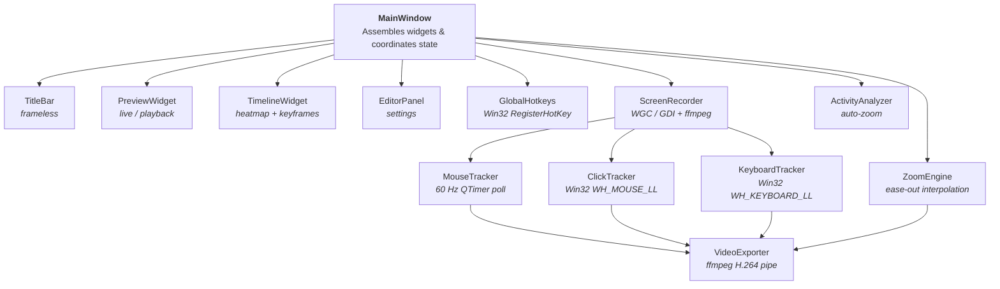

---

## App Lifecycle

### Two modes: Record → Edit

The app operates in two modes, switchable via the **sidebar**:

1. **Record mode** — Live capture preview, source selection, countdown, recording controls
2. **Edit mode** — Video playback, timeline, zoom keyframe editing, background/frame selection, export

`MainWindow._set_view()` manages the mode transition, showing/hiding widgets and loading video for playback when entering edit mode.

### Recording flow

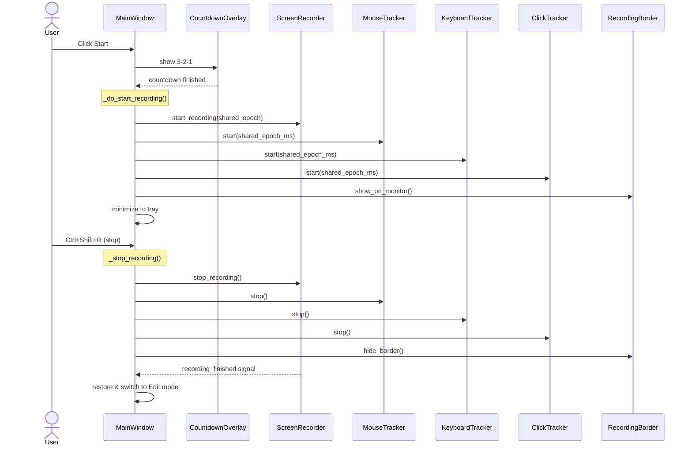

### Shared epoch

All four data streams (video frames, mouse positions, keyboard events, click events) share a single `time.time()` epoch set at the start of recording. This ensures timestamps are perfectly aligned without post-hoc synchronization.

---

## Data Model

All data classes live in `app/models.py`.

### Core types

| Class | Fields | Purpose |
| ----- | ------ | ------- |
| `MousePosition` | `x, y, timestamp` | Absolute screen coords at ~60 Hz |
| `KeyEvent` | `timestamp, x, y` | Keystroke time + cursor position (no key identity — privacy) |
| `ClickEvent` | `x, y, timestamp` | Mouse click position + time |
| `ZoomKeyframe` | `id, timestamp, zoom, x, y, duration, reason` | Zoom instruction |
| `VideoSegment` | `id, start_ms, end_ms` | Contiguous time range of a split recording |
| `RecordingSession` | All of the above bundled + trim range + video segments | Serializable session data |

### ZoomKeyframe anatomy

```text
ZoomKeyframe:
  id        — UUID string (for tracking/deletion)
  timestamp — when the zoom transition STARTS (ms)
  zoom      — target zoom level (1.0 = no zoom, 2.0 = 2×)
  x, y      — normalized pan center (0-1), (0.5, 0.5) = center
  duration  — how long the transition takes (ms), eased via ease-out curve
  reason    — human-readable label ("Typing activity detected")
```

Zoom operations always come in pairs: a **zoom-in** keyframe (`zoom > 1.0`) followed by a **zoom-out** keyframe (`zoom = 1.0`). The engine interpolates smoothly between them.

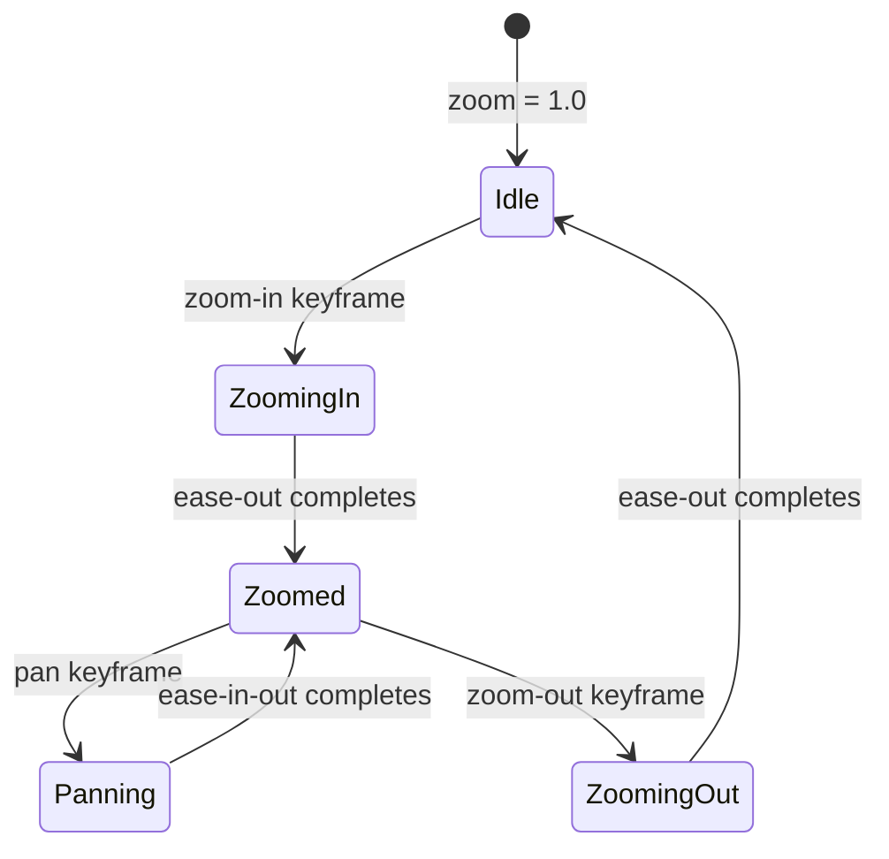

---

## Screen Capture

### Backend selection

`ScreenRecorder` tries backends in order:

1. **Windows Graphics Capture (WGC)** — hardware-accelerated, lowest latency, requires Windows 10 1903+
2. **GDI fallback** — `mss` screenshot library, works everywhere but is CPU-based

The active backend is shown in the status bar (`⚡ WGC` or `🖥 GDI`).

### Recording pipeline

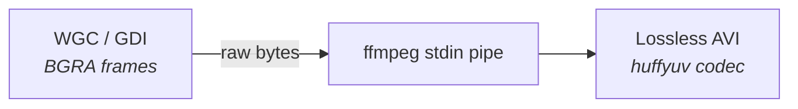

- Frames are piped as raw BGRA bytes directly to ffmpeg's stdin
- Intermediate format is **huffyuv** (lossless) inside AVI — fast to write, preserves quality
- No temporary image files are created
- A hybrid sleep function (`_precise_sleep`) uses coarse sleep + spin-wait for sub-millisecond frame timing accuracy

### Window capture

For individual windows, `PrintWindow` (Win32 API via ctypes) captures the window content without bleed-through from overlapping windows. The captured buffer is in physical pixels (DPI-aware).

---

## Zoom Engine

`ZoomEngine` (`app/zoom_engine.py`) is a pure-Python keyframe interpolator:

### Easing functions

Two easing curves are used depending on the transition type:

- **Quintic ease-out** ($f(t) = 1 - (1-t)^5$) — zoom transitions. Fast start, asymptotic deceleration. ~80% of movement completes in the first 40% of duration.
- **Quintic ease-in-out / smoothstep** ($f(t) = 6t^5 - 15t^4 + 10t^3$) — pan point transitions. Zero velocity at both endpoints for smooth camera pans.

The old `smooth_step` name is kept as an alias for backward compatibility.

### Interpolation

`compute_at(time_ms)` finds the active keyframe, computes progress through its transition, applies the easing curve, and linearly interpolates zoom level + pan position.

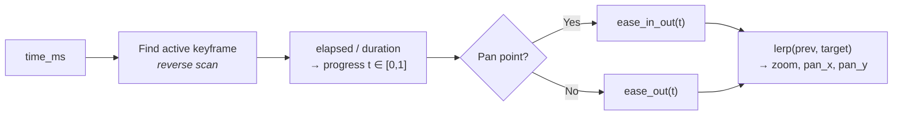

Returns `(zoom, pan_x, pan_y)` — consumed by both the live preview and the video exporter.

### Pan Path Points

Pan path points are intermediate `ZoomKeyframe` entries placed between a segment's zoom-in and zoom-out keyframes. They share the same zoom level as the segment start but have different `(x, y)` positions, creating a smooth panning path within the zoomed view.

Since the zoom engine already interpolates between consecutive keyframes, no engine changes are needed — pan points are simply regular keyframes with `reason="Pan point"` and a shorter transition duration (400 ms). The timeline draws numbered yellow circle markers at each pan point position. Users can:

- **Add** pan points via right-click on the preview surface while zoomed in → "📌  Add pan point here"
- **Reorder** via the context menu (Move earlier/later swaps timestamps) or by dragging markers horizontally
- **Reposition** the camera target via "📍 Pick center on preview"
- **Delete** individual pan points

### Undo / Redo

`ZoomEngine` maintains snapshot-based undo/redo stacks (max depth 50). Each snapshot captures both the zoom keyframe list and the click event list so that click deletions are fully undoable. Before any mutation (keyframe edit or click deletion), the caller invokes `push_undo()` which stores a `copy.deepcopy()` of both lists. `undo()` swaps the current state with the top of the undo stack (pushing the current state onto redo), and `redo()` does the reverse.

Drag operations use a debounce flag (`_drag_undo_pushed`) so that a continuous drag only creates a single undo snapshot. The flag resets when the mouse is released (`drag_finished` signal).

---

## Activity Analyzer

`ActivityAnalyzer` (`app/activity_analyzer.py`) auto-generates zoom keyframes by analyzing recorded input data. It detects two signal types:

### 1. Typing zones

Detects when the mouse is nearly stationary while keys are being pressed — indicates text editing.

- Requires mouse speed < 3 px/ms and keystrokes-per-second ≥ 1.0
- When `KeyEvent` objects carry cursor positions (`x`/`y`), the zoom targets the keystroke location directly — more accurate than inferring position from the mouse track
- Score = KPS × `WEIGHT_TYPING (1.0)`

### 2. Click clusters

Detects ≥ 1 mouse click within a 3-second sliding window — indicates deliberate interaction.

- Even a single click generates a zoom event (single clicks are intentional user actions)
- Zoom targets the centroid of the click positions
- Score = click count × `WEIGHT_CLICK (1.2)` — highest-weighted signal

Mouse settlements (cursor resting after fast movement) are **not** used as zoom triggers.

### Keyboard event filtering

The keyboard tracker (`keyboard_tracker.py`) uses a Win32 low-level hook (`WH_KEYBOARD_LL`). To prevent modifier keys and app hotkey combos from inflating typing activity signals, the hook checks the virtual key code from `KBDLLHOOKSTRUCT` and skips:

- Modifier keys: Ctrl, Shift, Alt, Win (both generic and left/right variants)
- Lock keys: CapsLock, NumLock, ScrollLock
- App hotkey keys: R (`0x52`), `=` (`0xBB`), `-` (`0xBD`)

These key-down events are still passed along via `CallNextHookEx` so other hooks and the hotkey system work normally — they are simply not recorded as `KeyEvent` timestamps.

### Spatial-aware clustering

After peak detection, peaks are clustered not just by time proximity but also by **spatial proximity**. Same-type peaks (click or typing) that are close in screen position (< 15% normalised distance) are merged into the same cluster even if their time gap exceeds the base `min_gap_ms` — up to 8 s for clicks and 6 s for typing. This prevents repeated zoom-out / zoom-in cycles when the user clicks or types in the same area with small pauses.

Merged clusters use the full time range (first peak → last peak) for zoom-in / zoom-out timing, so the camera stays zoomed in for the entire activity span rather than just a single peak moment.

### Maximum cluster duration

After spatial clustering, any cluster whose time span exceeds `MAX_CLUSTER_DURATION_MS` (8000 ms) is split into sub-clusters by walking through its peaks and starting a new sub-cluster whenever the next peak would push the span past the limit. This prevents a single zoom block from spanning the entire video when activity (e.g. form-filling) is spread continuously across many seconds.

### Pan-while-zoomed chains

After spatial clustering, consecutive clusters whose gaps are within `PAN_MERGE_GAP_MS` (1500 ms) are grouped into **chains**. Chains are capped at `MAX_CHAIN_LENGTH = 4` clusters — if more consecutive clusters exist, a new chain starts. The gap is measured from the actual activity **end** of one cluster to the **start** of the next (the hold/dwell period is excluded from the gap calculation so it doesn't cause unintended chaining). Within a chain:

- The camera **zooms in** at the first cluster
- For each subsequent cluster, a **pan keyframe** slides the viewport to the new target while staying zoomed — no zoom-out / zoom-in cycle
- Pan transition duration scales with screen distance (`PAN_TRANSITION_MS = 400` ms minimum, `PAN_TRANSITION_MAX_MS = 700` ms maximum)
- The camera **zooms out** only after the last cluster in the chain

Pan keyframes receive a reason string like "Pan to: typing activity detected".

### Viewport centering

The viewport **centers** on the activity target (typing field or click location) and is clamped so it stays within source bounds. This ensures the zoom always goes directly to where the user is working.

### Pipeline

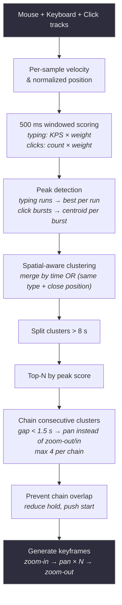

Configurable via sensitivity presets (Low/Medium/High) which vary `max_clusters` and `min_gap_ms`.

#### Chain keyframe generation

When consecutive activity clusters are close enough in time, they are grouped into a **chain**. The camera stays zoomed in and pans between clusters rather than zooming out and back in:

```mermaid
gantt
    title Pan chain example (3 clusters)
    dateFormat X
    axisFormat %s

    section Zoom
    Zoom in (ease-out)        :active, z1, 0, 600

    section Activity
    Click cluster 1           :crit, c1, 700, 2700
    Typing cluster 2          :crit, c2, 3500, 6500
    Click cluster 3           :crit, c3, 7200, 9200

    section Camera
    Pan to cluster 2          :p1, 2700, 3500
    Pan to cluster 3          :p2, 6500, 7200
    Zoom out (ease-out, 2×)   :active, z2, 11200, 12400
```

---

## AI Service

`AIService` (`app/ai_service.py`) provides optional AI-powered features via Azure AI Foundry. All AI operations are run on a background `AIWorker(QThread)` to keep the GUI responsive.

### AI Smart Zoom

An alternative to the local activity analyzer. Instead of heuristic-based peak detection, the recording activity is summarized into a compact text format and sent to an LLM (via `azure-ai-inference` SDK's `ChatCompletionsClient`). The AI model returns a JSON array of zoom sections with timestamps, positions, zoom levels, and reasons.

**Data flow:**

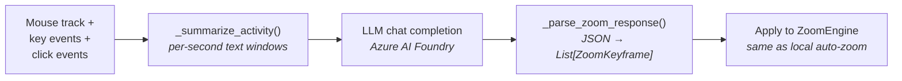

The summary condenses thousands of mouse samples into ~1 line per second of recording, making it feasible for LLM context windows.

### Voiceover (TTS)

Segment-based voiceover system:

- Users create `VoiceoverSegment` objects at specific timeline positions (via right-click on timeline/preview or the editor panel button)
- Each segment has: `id`, `timestamp`, `text`, `voice`, `audio_path`, `duration_ms`
- Speech synthesis sends user-authored text to Azure AI Foundry's TTS model endpoint (`/openai/deployments/{model}/audio/speech`) and saves the resulting MP3
- Segments are stored in `MainWindow._voiceover_segments` and serialized into `.fcproj` via `RecordingSession.voiceover_segments`
- Timeline renders voiceover segments as teal pill-shaped blocks on a dedicated **Voice** track row
- Clicking a segment opens an edit dialog (change text, re-synthesize, delete)

**Export merging**: `_merge_voiceover_segments()` in `video_exporter.py` uses ffmpeg's `adelay` + `amix` filters to combine multiple audio files at their correct timeline offsets into a single WAV. The merged audio is muxed into the MP4 as an AAC track (`-c:a aac -b:a 192k -shortest`). Temp files are cleaned up after export.

### Configuration

AI settings are persisted via `QSettings` under the `ai/` prefix:

- `ai/endpoint` — Azure AI Foundry endpoint URL
- `ai/apiKey` — API key or token
- `ai/chatModel` — chat model deployment name
- `ai/ttsModel` — TTS model deployment name
- `ai/ttsVoice` — voice name (default: "alloy")

---

## Video Export

`VideoExporter` (`app/video_exporter.py`) renders the final MP4 or GIF:

### Export Pipeline

```mermaid
flowchart TD
    subgraph Phase 1 — Probe
        SRC["Source AVI<br/><i>lossless huffyuv</i>"] --> PROBE["OpenCV VideoCapture<br/><i>probe FPS, frame count,<br/>recount if metadata/duration mismatch > 10%</i>"]
    end

    subgraph Phase 2 — Precompute
        PROBE --> BG["Build background<br/><i>solid / gradient / wavy / radial / spotlight</i>"]
        BG --> BEZEL["Build bezel layer<br/><i>rounded rects, drop shadow, edge</i>"]
    end

    subgraph Phase 3 — Audio
        BEZEL --> VO{"Voiceover\nsegments?"}
        VO -- Yes --> MERGE["Merge via ffmpeg<br/><i>adelay + amix → WAV</i>"]
        VO -- No --> LAUNCH
        MERGE --> LAUNCH
    end

    subgraph Phase 4 — Frame rendering
        LAUNCH["Launch ffmpeg<br/><i>rawvideo stdin pipe</i>"] --> TIMELINE
        TIMELINE["CFR output timeline<br/><i>t = trim_start + n / fps</i>"] --> BISECT["bisect source_timestamps<br/><i>pick source frame for t</i>"]
        BISECT --> COMPOSE["Compose frame<br/><i>zoom/pan + cursor + clicks</i>"]
        COMPOSE --> Q["Bounded queue<br/><i>depth 16</i>"]
    end

    subgraph Phase 5 — Encode
        Q --> WRITER["Writer thread<br/><i>queue → stdin.write</i>"]
        WRITER --> FFMPEG["ffmpeg<br/><i>H.264 or GIF palette</i>"]
        FFMPEG --> OUT["MP4 / GIF"]
    end

    style SRC fill:#2d2d3d,stroke:#888,color:#eee
    style OUT fill:#2d2d3d,stroke:#888,color:#eee
```

A dedicated **writer thread** drains composed frames from a bounded queue (depth 16) into ffmpeg's stdin pipe while the main compositor thread prepares the next frame. This overlaps CPU compositing with GPU encoding so that hardware encoders (NVENC, QuickSync, AMF) stay fed and don't sit idle waiting for the next frame.

For recordings captured with sparse/variable source frames (common with WGC when the desktop is static), export first builds a timestamp map and then renders on a stable CFR timeline. Source frames are selected with timestamp lookup (same policy as preview playback), and frames are duplicated when needed to fill timeline gaps. This keeps cursor/click overlays and voiceover audio aligned with the visual timeline.

### GIF export

When the output path ends in `.gif`, the exporter uses a palette-based GIF pipeline instead of the H.264 encoder chain. The ffmpeg filtergraph runs `fps=15,split[s0][s1];[s0]palettegen=max_colors=256:stats_mode=diff[p];[s1][p]paletteuse=dither=bayer:bayer_scale=5:diff_mode=rectangle` in a single pass. The `GIF_FPS` constant (default `15`) and `build_gif_args()` helper live in `app/utils.py`. The encoder fallback chain is not used for GIF exports.

### Encoder selection

`detect_available_encoders()` in `app/utils.py` probes ffmpeg at startup to discover which H.264 encoders are available on the current system. The function tests NVENC (NVIDIA), QuickSync (Intel), and AMF (AMD) by running a short encode and checking the exit code. `best_hw_encoder()` returns the fastest available GPU encoder, falling back to `libx264`.

The `ENCODER_PROFILES` dict in `app/utils.py` maps each encoder ID to its ffmpeg arguments (codec, quality flags, preset). HW encoder quality args are tuned to approximate the CRF 18 quality level of libx264. `build_encoder_args()` returns the ready-to-use arg list for any supported encoder.

The user's encoder choice is persisted via `QSettings` and restored on next launch. The editor panel's ⚙ settings menu exposes a **Video encoder** submenu listing available encoders with a checkmark on the active one. During export, the status bar displays the active encoder name (e.g., "Encoding with NVIDIA NVENC…").

### Encoder fallback

The exporter uses a **two-phase fallback chain** strategy that tries other available HW encoders before falling back to software:

1. **Immediate check** — after launching ffmpeg, the exporter sleeps 100 ms and polls the process. If it has already exited (e.g., driver issues or unsupported parameters), the exporter tries the next available HW encoder in priority order (NVENC → QuickSync → AMF). Only after all HW encoders are exhausted does it fall back to `libx264`.
2. **Mid-stream retry** — if the hardware encoder fails partway through encoding (broken pipe or `OSError`), the exporter catches the error and restarts the full encode, walking the same fallback chain from the next HW encoder down to `libx264`.

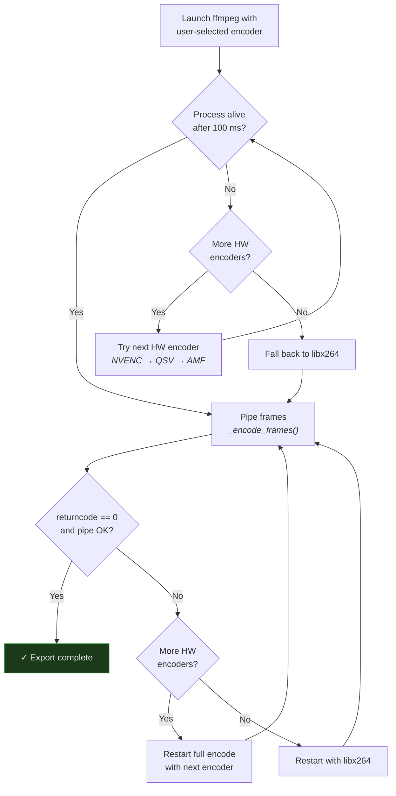

A warning is logged with the original ffmpeg stderr output. `VideoExporter` emits a `status = Signal(str)` that `MainWindow._on_export_status()` connects to — on each fallback attempt, the status bar is updated with the display name of the encoder being tried (e.g., "Encoder fallback: trying Intel QuickSync…", then "Encoder fallback: using libx264…"). On Windows, pipe writes to a dead ffmpeg process may raise `OSError(22, 'Invalid argument')` instead of `BrokenPipeError`; both are caught gracefully.

### Export parameters

| Parameter | Default value |
| --------- | ------------- |
| Codec | H.264 — auto-selected GPU encoder or libx264 fallback |
| Quality | CRF 18 equivalent (tuned per encoder) |
| Preset | medium (software) / p4 or equivalent (hardware) |
| Pixel format | yuv420p |
| Pipe method | Raw frames via stdin |

The export runs in a background thread with progress signals emitted to the UI.

### Trimming

The exporter accepts optional `trim_start_ms` and `trim_end_ms` parameters. When set, export starts and ends on those timeline times. Frame selection is timestamp-based, so sparse source recordings still preserve wall-clock timing inside the trimmed range. Progress reporting is based on trimmed timeline duration rather than raw decoded frame count.

---

## Compositor

Two compositor implementations exist for different contexts:

| Compositor | Technology | Used by |
| ---------- | --------- | ------- |
| `compositor.py` | QPainter (Qt) | Live preview widget |
| `video_exporter.py` (inline) | NumPy + OpenCV | Video export |

Both produce identical output: gradient background → device bezel (rounded rect with edge highlights) → screen content (zoomed/panned) → cursor + click effects.

Zoom behavior is **conditional on the active frame preset**:

- **No Frame**: zoom/pan applies only to the video content inside the screen area — background stays static. Cursor and click overlays use virtual screen-rect mapping: their positions are transformed into the zoomed coordinate space and clipped to the screen area.
- **Device frame (any bezel)**: zoom/pan moves the device (frame + video) while the background stays static — like physically bringing a device closer and moving it around. The background gradient/pattern is always visible and never zooms.

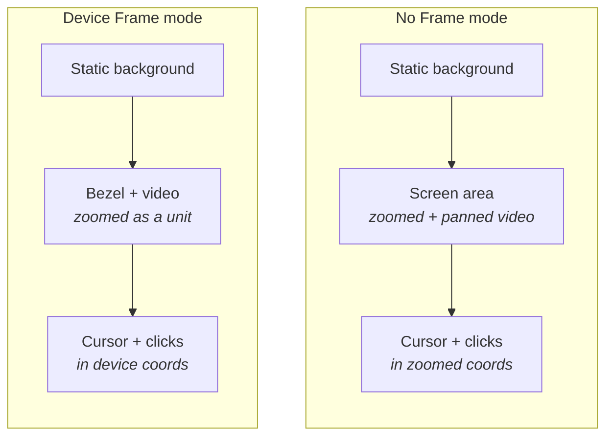

### Preview canvas sizing

The preview widget sizes its canvas based on the selected output dimensions. The compositor's `compose_scene` is called with `(canvas_w, canvas_h)` instead of the full widget dimensions, and the painter is translated and clipped to the canvas rect.

- **Auto (source)**: The canvas is letterboxed or pillarboxed to match the source video's native aspect ratio.
- **Non-auto presets** (e.g., 1:1, 4:3, 9:16): The compositor renders at the target aspect ratio with the device frame fitted and centered within it, giving an accurate preview of the export result.

This replaces the previous scrim-overlay approach where the full scene was rendered at widget size and a semi-transparent dark overlay was drawn over margin areas.

---

## Input Tracking

### Mouse tracker

`MouseTracker` uses a `QTimer` at 60 Hz to poll `QCursor.pos()`. Simple and reliable — no hooks needed for position tracking.

### Keyboard tracker

`KeyboardTracker` installs a **Win32 low-level keyboard hook** (`WH_KEYBOARD_LL`) via `ctypes`. Each keystroke records a timestamp and the current cursor position (via `GetCursorPos`). No key identities are stored, for privacy. The cursor position is used by the activity analyzer to determine where typing is happening, independent of mouse track interpolation.

**Critical:** Uses `WINFUNCTYPE` (not `CFUNCTYPE`) for 64-bit Windows compatibility. Hook callbacks have explicit `argtypes` and `restype` to prevent integer overflow on 64-bit pointers.

### Click tracker

`ClickTracker` installs a **Win32 low-level mouse hook** (`WH_MOUSE_LL`) to detect left/right clicks. Records position + timestamp.

### Hook safety

All hooks run in dedicated threads with their own Win32 message loops. `CallNextHookEx` is always called to avoid blocking other applications. Hook threads append events directly to a shared list (CPython GIL ensures thread-safe `list.append`) instead of using cross-thread Qt signals, preventing event loss from unprocessed signal queues. Hook callbacks are wrapped in `try/except` to prevent exceptions from crashing the hook thread.

---

## UI Architecture

### Frameless window

The app uses `Qt.WindowType.FramelessWindowHint` with a custom `TitleBar` widget that handles:

- Drag-to-move (OS-native via `QWindow.startSystemMove()` for Windows Aero Snap support)
- Double-click to maximize/restore
- Minimize / maximize / close buttons
- Export button

### Theme

`DARK_THEME` in `app/theme.py` is a comprehensive QSS stylesheet (~200 lines). All styling is done via QSS, not QPalette manipulation (palette provides minimal base colors only).

### Widget communication

All inter-component communication uses Qt **signals and slots**:

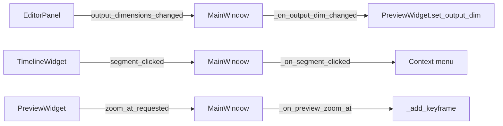

### Threading model

| Thread | Purpose |
| ------ | ------- |
| Main (GUI) thread | All Qt widgets, painting, event handling |
| Recording thread | Frame capture loop (WGC/GDI → ffmpeg pipe) |
| Keyboard hook thread | Win32 `WH_KEYBOARD_LL` message loop |
| Click hook thread | Win32 `WH_MOUSE_LL` message loop |
| Export thread | Frame-by-frame render + ffmpeg pipe |
| Hotkey thread | Win32 `RegisterHotKey` + `GetMessage` loop |
| Thumbnail threads | Background thumbnail generation for source picker |
| `_LoadProjectWorker` | Background ZIP extraction and session deserialization when loading `.fcproj` files |

---

## Processing Overlay

`ProcessingOverlay` (`app/widgets/processing_overlay.py`) is a full-window pulsing banner used to block interaction and provide feedback during long-running operations. It is **reusable** — the `show_overlay(title, subtitle)` method accepts configurable text, so the same widget serves multiple contexts:

| Context | Title | Subtitle |
| ------- | ----- | -------- |
| Finalizing a recording | "Processing…" | "Finalizing your recording" |
| Loading a project file | "Loading project…" | "Extracting and restoring session" |

When loading a `.fcproj` file, the heavy work (ZIP extraction, JSON deserialization, AVI copy) runs on a background `_LoadProjectWorker(QThread)` so the UI stays responsive. The overlay is shown before the worker starts and hidden when it emits its `finished` signal.

---

## Logging

All diagnostic output uses Python's `logging` module instead of bare `print()` calls. Each module creates a module-level logger:

```python
import logging
logger = logging.getLogger(__name__)
```

`logging.basicConfig()` is configured in `main.py` with:

```python
logging.basicConfig(
    level=logging.INFO,
    format="%(name)s | %(levelname)s | %(message)s",
)
```

This provides consistent, filterable output with the originating module name and severity level in every log line.

---

## Project Files

`.fcproj` files are ZIP archives containing:

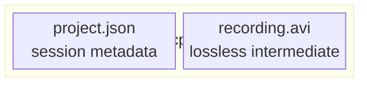

The JSON includes:

- Recording session data (mouse positions, key events, click events, zoom keyframes)
- Monitor geometry
- Actual FPS
- Background and frame preset names

### Incremental Save

When re-saving to an existing `.fcproj`, `save_project(metadata_only=True)` rewrites only `project.json` without reading or copying the video data. Full saves always write the video entry first at file offset 0; metadata saves then modify the ZIP in-place by seeking past the video's raw bytes and overwriting just the JSON local-file-header, central directory, and EOCD record. Total I/O is O(JSON_size) — typically a few KB — regardless of video size. If the in-place layout precondition isn't met (e.g. old-format files with JSON first), a streaming fallback copies the video in 8 MB chunks to a new ZIP.

---

## Build & Distribution

### PyInstaller

`build.bat` produces a single-folder distribution:

```text
dist/FollowCursor/
├── FollowCursor.exe
├── PySide6/          (only QtCore, QtGui, QtWidgets, QtSvg)
├── cv2/
├── numpy/
└── ...
```

40+ unused PySide6 modules are explicitly excluded (QtWebEngine, Qt3D, QtMultimedia, QtQml, etc.) to keep the distribution small.

### CI/CD

GitHub Actions (`.github/workflows/build.yml`):

- Triggers on push/PR to `main` and on `v*` tags
- Extracts version from `app/version.py`
- Builds with PyInstaller on `windows-latest`
- Uploads versioned artifact
- Creates GitHub Release on version tags

---

## Key Design Decisions

### DPI awareness

PySide6 automatically sets `PER_MONITOR_DPI_AWARE_V2`. **Never** call `SetProcessDpiAwareness` manually — it would conflict with Qt's own handling.

### No compositor during recording

During recording, the preview widget shows a **static blurred snapshot** instead of live compositor output. This avoids doubling the GPU/CPU work and keeps frame capture at full speed.

### Wall-clock playback

Video playback uses `time.perf_counter()` anchored at play-start, not QTimer tick counting. This eliminates:

- Timer interval rounding drift (`int(1000/60) = 16` instead of 16.67)
- Frame position off-by-one from OpenCV's `CAP_PROP_POS_FRAMES` returning the next frame index

### Clean shutdown

`closeEvent` calls `os._exit(0)` to avoid Qt cleanup hangs caused by native Win32 hooks still holding threads.

### Error resilience

- **Global exception handler:** `sys.excepthook` is set in `main.py` to log unhandled exceptions via the `logging` module instead of crashing silently.
- **Recording guards:** `_do_start_recording()` and `_stop_recording()` are wrapped in `try/except` — failures are logged and the UI is restored to a usable state.
- **Finalize guard:** `_on_finalize_done()` catches exceptions from post-recording processing and hides the processing overlay gracefully.
- **Hook callbacks:** Win32 hook callbacks in `click_tracker.py` and `keyboard_tracker.py` wrap their logic in `try/except` to prevent a crash from tearing down the hook thread.
- **Export pipe errors:** Both `BrokenPipeError` and `OSError` are caught when writing to the ffmpeg pipe (Windows raises `OSError(22)` instead of `BrokenPipeError`).
- **Encoder fallback chain:** If a hardware encoder fails, the exporter tries the next available HW encoder in priority order before falling back to `libx264`.

### Frame preset naming

Frame presets use generic names (Wide Bezel, Slim Bezel) — never trademarked device names.
