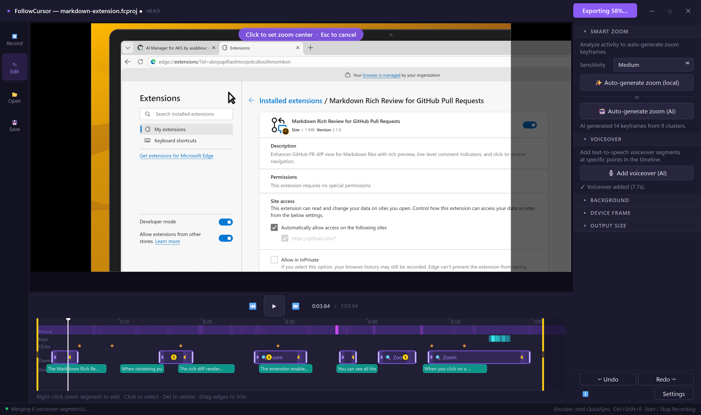

# FollowCursor

**A Windows screen recorder with cinematic cursor-following zoom.**

Record your screen or any individual window, then export a polished MP4 or GIF where the camera smoothly follows and zooms into your cursor movements. Perfect for tutorials, demos, and product walkthroughs.

---

## :fluent-arrow_upload_20_regular: Key Features

-   :fluent-record_20_regular: **Screen & Window Recording**

    ---

    Capture any monitor via hardware-accelerated Windows Graphics Capture, or record individual windows without bleed-through.

-   :fluent-search_20_regular: **Smart Zoom**

    ---

    Auto-detect typing bursts and click clusters to generate cinematic zoom keyframes — or let AI analyze your recording like a professional cameraman.

-   :fluent-mic_20_regular: **AI Voiceover**

    ---

    Add text-to-speech narration at any point in your timeline with Azure AI Foundry TTS. Six voice options, adjustable rate and volume.

-   :fluent-brightness_high_20_regular: **Visual Polish**

    ---

    84 background presets, 5 device frame styles, annotations (text, arrows, highlights), click effects, and keystroke overlays.

-   :fluent-video_20_regular: **Cinematic Export**

    ---

    H.264 MP4 with GPU acceleration (NVENC, QuickSync, AMF) or GIF with palette-based encoding. Cursor, click ripples, and voiceover baked in.

-   :fluent-save_20_regular: **Project Files**

    ---

    Save and resume work with `.fcproj` bundles. Full undo/redo, trimming, segment deletion, and chapter markers.

---

## Get Started

New here? Follow the **[Quickstart Guide](QUICKSTART.md)** to record, edit, and export your first video in under 5 minutes.

Looking for every option and feature? Read the **[User Guide](USER_GUIDE.md)**.

Want to contribute? See the **[Contributing Guide](CONTRIBUTING.md)** for dev setup, coding conventions, and how to submit changes.

---

## Architecture at a Glance

| Layer | Technology | Purpose |
| ----- | ---------- | ------- |
| UI Framework | PySide6 (Qt 6) | Widgets, layout, painting, signals/slots |
| Screen Capture | Windows Graphics Capture (WGC) | Hardware-accelerated monitor/window capture |
| Window Capture | Win32 PrintWindow (ctypes) | Per-window capture without bleed-through |
| Recording Pipe | ffmpeg via imageio-ffmpeg | H.264 intermediate codec piped via stdin |
| Video Export | ffmpeg (libx264 / HW accel) | H.264 MP4 or GIF with zoom/cursor baked in |
| Image Processing | OpenCV + NumPy | Frame manipulation, thumbnails, cursor rendering |
| Input Tracking | Win32 Hooks (ctypes) | Low-level mouse, keyboard, and click tracking |
| Zoom Engine | Pure Python | Quintic ease-out keyframe interpolation |
| AI Features | Azure AI Foundry | AI zoom analysis, TTS voiceover |
| Design System | tokens.py + Fluent 2 | 4px grid, semantic colors, consistent spacing |

For the full deep-dive, see the **[Architecture Guide](ARCHITECTURE.md)**.
